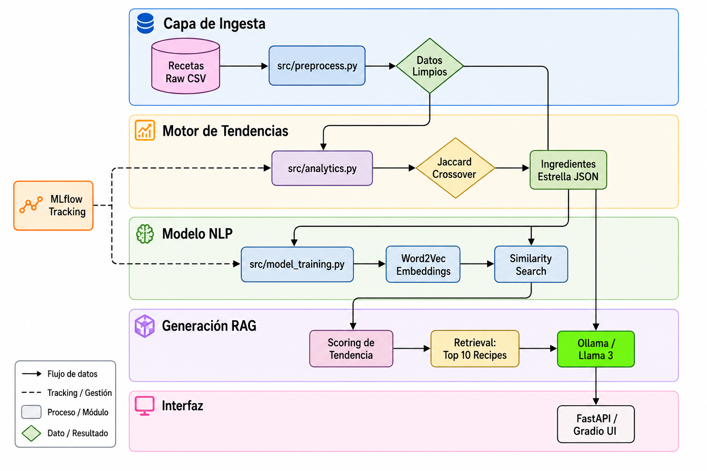

# Motor de recomendación de recetas culinarias

## 1. Arquitectura del Sistema

### Diagrama End-to-End

### Flujo de Datos Detallado
El sistema opera a través de cinco capas interconectadas que transforman datos crudos en una receta creativa estructurada:

1. **Capa de Ingesta y Limpieza:** El proceso comienza con la carga de un dataset masivo en formato CSV. El módulo `src/preprocess.py` normaliza los datos (tiempos, ratings), selecciona según un ranking(de 4 estrellas o más) y realiza un **parsing crítico** de ingredientes, convirtiendo texto libre en listas estructuradas mediante NLP y reglas heurísticas.
2. **Engine de Tendencias:** Utiliza la lógica de **Jaccard Crossover** en `src/analytics.py`. El flujo identifica ingredientes con alta presencia en la intersección de dominios (Dulce vs. Salado). Tras filtrar el "ruido" (ingredientes estructurales como sal o agua), se extraen los **Ingredientes Estrella**.
3. **Modelo NLP:** Las instrucciones de cocina se procesan en `src/model_training.py`. Se entrena un modelo **Word2Vec** para generar embeddings que capturan la semántica técnica de las recetas. Esto permite que el sistema entienda procesos culinarios más allá de las palabras clave.
4. **Generación RAG (Retrieval-Augmented Generation):**
    * **Scoring:** Las recetas se rankean según su afinidad con los ingredientes tendencia.
    * **Retrieval:** Se seleccionan las 10 recetas más similares vectorialmente a la receta líder.
    * **Generación:** Se inyectan estas referencias como contexto a **Llama 3 (vía Ollama)**, que actúa como un chef creativo sintetizando una receta nueva y coherente.
5. **Interfaz y Gestión:** El resultado se expone mediante **FastAPI** y una UI en **Gradio**. Todo el ciclo de vida (parámetros y modelos) es monitoreado por **MLflow Tracking**.

---

## 2. Diseño Técnico

### Stack Propuesto
* **Lenguajes:** Python 3.10+
* **ML Ops:** MLflow (Tracking & Registry).
* **NLP:** Gensim (Word2Vec), NLTK, Ingredient-parser.
* **LLM:** Ollama / Llama 3 (Inferencia local).
* **Backend/Frontend:** FastAPI y Gradio.

### Stack de librerias 
### Requerimientos del Sistema (Dependencies)

Para asegurar la reproducibilidad del proyecto, se deben instalar las siguientes librerías:

* pandas==2.2.0
* numpy==1.26.4
* mlflow==2.11.0
* nltk==3.8.1
* ingredient-parser==0.1.0
* gensim==4.3.2
* scikit-learn==1.4.1
* ollama==0.1.7
* fastapi==0.109.2
* uvicorn==0.27.1
* gradio==4.19.1
* matplotlib==3.8.3
* requests==2.31.0
* matplotlib-venn==0.11.10

---

### Justificación
La arquitectura del sistema ha sido diseñada priorizando la semántica culinaria, la eficiencia operativa y la reproducibilidad científica. A continuación, se detallan las justificaciones de las herramientas clave:

* **Word2Vec (Gensim) vs. Métodos Tradicionales:** Se seleccionó Word2Vec sobre aproximaciones como TF-IDF o Bag-of-Words porque estas últimas se limitan al conteo de frecuencias. Word2Vec captura la **afinidad semántica** y funcional; el modelo entiende que si una receta menciona "shoyu" y otra "salsa de soja", ambas comparten un contexto técnico similar. Esto permite que el buscador de similitud de coseno identifique recetas técnicamente compatibles incluso si el léxico varía.

* **Ollama (Llama 3) para Inferencia Local:** La elección de un motor local responde a tres pilares estratégicos:
    1.  **Privacidad:** Los datos del dataset propietario y las recetas generadas permanecen íntegramente en la infraestructura local.
    2.  **Costo-Eficiencia:** Al ser un pipeline de experimentación constante con múltiples iteraciones de RAG, el uso de APIs externas generaría costos operativos variables e impredecibles.
    3.  **Baja Latencia:** Se eliminan los cuellos de botella de red durante la fase de síntesis de la receta, permitiendo una experiencia de usuario fluida en la interfaz.

* **MLflow como Eje de Reproducibilidad:** MLflow no se limita al registro de métricas; actúa como el **garante del linaje de datos (Data Lineage)**. Dado que las tendencias gastronómicas son volátiles, MLflow permite "viajar en el tiempo" para auditar qué ingredientes fueron marcados como tendencia en versiones anteriores del dataset, facilitando el debugging y la comparación de modelos Word2Vec históricos.

* **FastAPI & Gradio (Desacoplamiento de Servicio):** Se optó por una arquitectura desacoplada donde **FastAPI** actúa como el núcleo de cómputo asíncrono, exponiendo la lógica de negocio mediante endpoints robustos. **Gradio** se utiliza como la capa de frontend rápido (human-in-the-loop), permitiendo validar visualmente la coherencia técnica de las creaciones del "AI Chef" antes de cualquier despliegue a producción.

* **NLTK & Ingredient-Parser:** Se justifica su inclusión debido a que la limpieza de datos constituye el 80% del éxito del pipeline. Un parsing de ingredientes deficiente sesgaría los resultados del índice de Jaccard, generando falsos positivos en la detección de tendencias.

---

## 3. Modelado y Features

* **Ingredientes:** Representados como tokens normalizados tras remover listas de ruido predefinidas.
* **Recetas:** Vectorizadas mediante el promedio de vectores de sus instrucciones para priorizar la "técnica".
* **Tendencias:** Detectadas mediante el crecimiento anómalo en la intersección de categorías (Crossover).

### Un breve marco teórico 
### Justificación Metodológica: Análisis de Tendencias mediante Teoría de Conjuntos (Jaccard Logic)

Para fundamentar la fase de **Ingeniería de Variables** y potenciar la capacidad creativa del modelo **Ollama (Llama 3)**, se realizó un análisis basado en la teoría de conjuntos y la distribución de frecuencias de los ingredientes.

#### 1. Identificación de Ingredientes "Crossover" (Intersección)
En lugar de analizar las categorías de forma aislada, se extrajeron los universos de ingredientes de recetas **Dulces (Set A)** y **Saladas (Set B)** para hallar su **Intersección ($A \cap B$)**. 
*   Esta técnica permite identificar ingredientes con versatilidad técnica y sensorial demostrada.
*   Los ingredientes en la intersección actúan como "puentes culinarios", permitiendo que el generador proponga combinaciones innovadoras que mantienen una lógica química coherente.

#### 2. Priorización por Frecuencia de Uso
No todos los ingredientes en común tienen el mismo valor estratégico. Por ello, se aplicó un **Análisis de Frecuencia** sobre la intersección:
*   Se seleccionaron los **ingredientes más usados** dentro del conjunto de recetas saladas que pertenecen a la intersección con el mundo dulce.
*   Esto asegura que la "innovación" propuesta por la IA no sea errática, sino que esté basada en combinaciones que ya tienen una presencia sólida y exitosa en el dataset.

#### 3. Refinamiento mediante Filtrado de Ruido
Para que las tendencias reales fueran visibles, se implementó un filtro de **ingredientes estructurales** (ruido):
*   Se omitieron elementos omnipresentes como *salt, water, oils* y *garlic*.
*   Al eliminar estos componentes básicos, el análisis resalta ingredientes de alto impacto (ej. frutas, frutos secos o especias específicas), proporcionando al RAG un contexto de "alta gama" y verdaderamente diferenciador.

#### 4. Objetivo Final del RAG
Este proceso garantiza que el contexto entregado a la IA contenga solo lo mejor del dataset: recetas con **Rating > 4**, publicadas en los **últimos 2 meses** y que utilicen ingredientes validados por su frecuencia en la intersección de sabores.

### Somilitud de coseno 
### Justificación Teórica: Recuperación mediante Similitud de Coseno

Para la selección de las 10 recetas de referencia que alimentarán el contexto del modelo generativo, se utilizó la **Similitud de Coseno** sobre los vectores de receta (*embeddings*).

*   **¿Por qué Similitud de Coseno?**: A diferencia de la distancia euclidiana, el coseno mide el **ángulo entre dos vectores** en un espacio multidimensional. En el dominio gastronómico, esto es fundamental porque identifica recetas con la misma **orientación técnica y temática**, independientemente de la longitud de la lista de ingredientes.
*   **Captura de Relaciones Semánticas**: Al operar sobre `recipe_vector` (generado con Word2Vec), la métrica no busca coincidencias exactas de palabras, sino **proximidad de conceptos**. El sistema entiende que recetas con ingredientes análogos comparten un espacio vectorial cercano, garantizando una búsqueda por "estilo" y no solo por texto.
*   **Ranking de Precisión**: Esta métrica genera un score normalizado (0 a 1) que permite realizar un ranking exacto para extraer el **Top 10** de preparaciones que mejor capturan la esencia de nuestra "receta estrella".

### Implementación del RAG: Construcción de la Base de Conocimiento

La efectividad de un modelo de lenguaje depende directamente de la calidad de su contexto. En esta etapa, se consolidan los resultados de los análisis previos para alimentar al modelo **Ollama (Llama 3)**.

#### 1. Consolidación de Metadata Completa
Tras identificar las 10 recetas más relevantes mediante Similitud de Coseno, se realiza un proceso de **rehidratación de datos**. 
*   Se cruza la lista de nombres seleccionados (`recetas_para_rag.json`) con el dataset original (`recetas_ready.csv`).
*   Esto permite recuperar no solo el nombre del plato, sino la arquitectura técnica completa: proporciones exactas de ingredientes, técnicas de cocción y tiempos de preparación.

#### 2. Filtrado Selectivo para el Contexto
El objeto `df_rag` actúa como la **memoria a corto plazo** del sistema. En lugar de procesar miles de filas, el sistema se enfoca exclusivamente en las 10 referencias de mayor calidad que cumplen con los filtros de:
*   **Performance:** Recetas con Ratings superiores a 4.
*   **Actualidad:** Datos dentro de la ventana de los últimos 2 meses.
*   **Afinidad:** Máxima similitud vectorial con la tendencia detectada.

#### 3. Preparación para la Inferencia
Este filtrado es el paso final antes de la generación. Al limitar el contexto a estas 10 recetas, optimizamos el uso de la **ventana de contexto del LLM**, asegurando que cada palabra generada por el Chef IA esté fundamentada en técnicas reales y probadas presentes en nuestra base de datos técnica.

---

## 4. Métricas y Experimentación

### Métricas, Experimentación y Validación del Sistema

El éxito de este recomendador no se basa en una sola métrica, sino en un flujo de experimentación que valida la calidad de los datos desde la detección de la tendencia hasta la generación final del texto.

#### 1. Métricas de Relevancia: Intersección y Frecuencia
La primera etapa de validación utiliza métricas de frecuencia sobre conjuntos de datos:
*   **Intersección Cruda ($A \cap B$):** Mide la capacidad del sistema para detectar ingredientes "crossover" (versátiles) entre los universos dulce y salado.
*   **Frecuencia Pura:** Se utiliza para jerarquizar los resultados de la intersección. Esto asegura que la experimentación no se base en ingredientes accidentales, sino en elementos con una presencia estadística sólida en recetas de alto desempeño (Rating > 4).

#### 2. Métricas de Similitud: Distancia Vectorial (Coseno)
Una vez definida la tendencia, se mide la precisión del retrieval utilizando la **Similitud de Coseno**:
*   **Validación Semántica:** Se experimentó con vectores de receta para asegurar que el sistema recupere referencias técnicamente compatibles.
*   **Score de Proximidad (%):** Se utiliza este valor como métrica de confianza. Una similitud técnica cercana al 100% indica que las recetas de referencia mantienen la integridad del "ADN" de la receta estrella, reduciendo la varianza no deseada en el proceso de generación.

#### 3. Experimentación en Prompt Engineering (Ollama)
La fase final de métricas se centra en el comportamiento del LLM (**Llama 3**) mediante la optimización de instrucciones:
*   **Control de Creatividad:** Se ajustó el *System Prompt* para balancear la originalidad (fusión de sabores) con la estructura técnica (metadatos y pasos detallados).
*   **Filtro de Fidelidad:** El prompt obliga al modelo a basarse estrictamente en el contexto de las 10 recetas recuperadas. La métrica de éxito aquí es la **Consistencia Formativa**: que el resultado cumpla siempre con las 4 secciones requeridas (Name, Metadata, Ingredients, Instructions) en el idioma inglés.
*   **Reducción de Alucinaciones:** Al restringir el espacio de búsqueda (RAG) y refinar el prompt, se minimiza la invención de ingredientes que no existen en el dataset original o que no pertenecen a la ventana temporal de los últimos 2 meses.

---

## 5. Trade-offs y Riesgos

* **Cold Start:** Dificultad para detectar tendencias en ingredientes con muy pocas muestras.
* **Data Freshness:** Dependencia de la frecuencia de actualización del dataset CSV.
* **Calidad de Datos:** Riesgo de "Garbage In, Garbage Out" si el parsing inicial falla.
* **Sesgo Cultural:** El modelo reflejará los sesgos de cocina presentes en el dataset original.

##  Análisis de Distribución y Justificación de la Intersección

El análisis exploratorio de datos (EDA) reveló una fuerte polarización en el dataset, lo que motivó el uso de la **Intersección de Ingredientes** en lugar de métricas de similitud global para la detección de tendencias.

### 1. Desbalance de Clases (`w_sugar`)
El dataset presenta una distribución donde el **67%** de las recetas pertenecen a la categoría dulce (`w_sugar: 1`) frente a un **33%** de recetas saladas. 
* **Implicación:** Esta abundancia de azúcar (`white sugar`) como ingrediente predominante genera un "sesgo de categoría" que obligó a buscar un método para filtrar lo estructural de lo verdaderamente innovador.

### 2. Identificación de Ingredientes "Ruido"
Al observar el **Top 50 de Ingredientes Más Frecuentes**, se confirma que los elementos que encabezan la lista (*white sugar, salt, butter, flour*) son componentes estructurales. 
* Aunque estos 320 elementos en la intersección técnica existen, su valor para la innovación es bajo porque aparecen por necesidad técnica y no por intención creativa.
* **Decisión:** Se optó por extraer los elementos en común **filtrando esta lista de ruido**, permitiendo que ingredientes con menor frecuencia pero mayor identidad (como *pitted sweet cherries* o *harissa*) sean los que guíen la recomendación.

### 3. Potencial de Innovación Híbrida (Crossover)
El análisis identificó nichos de experimentación específicos al cruzar los ingredientes exclusivos:
* **De Dulce a Salado:** El uso de *raisin paste* o *apple juice* en contextos salados para aportar umami y acidez.
* **De Salado a Repostería:** La integración de elementos disruptivos como *serrano chile peppers* o *harissa* en perfiles dulces.

### Conclusión del Análisis
Se seleccionó el método de **Ingredientes en Común por Frecuencia** porque permite "limpiar" el peso estadístico del azúcar y los elementos básicos, rescatando únicamente los componentes versátiles que el modelo **Ollama** puede utilizar para fusionar técnicas de alta cocina de manera coherente.

---
## Notas

Un detalle a tener en cuenta es que el dataset se obtubo de **kaggle.com**, las fechas se generaron artificialmente simulando ser obtenidas de las ultimas punlicadas de una API. 

Por otro lado el modelo puede mejorarse y ampliarse, sin mencionar que se puede containerizar y migrar a la nube donde se pueden optimizar los procesos de ingesta hasta procesos de ejecusión.

